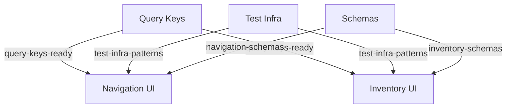

# 🎮 Phase 1-2 Implementation Master Control

**Status**: ✅ Multi-Agent Architecture Ready  
**Date**: 2025-08-26  
**Agents**: 5 Parallel Implementation Agents  
**Strategy**: TDD RED→GREEN→REFACTOR  

---

## 🚀 Quick Start Guide

### Step 1: Open 5 Claude Code Tabs
Open 5 separate Claude Code instances (browser tabs or windows)

### Step 2: Initialize Each Agent
Copy and paste the corresponding prompt from `agent-prompts/`:

| Tab | Agent | Prompt File | Primary Task |
|-----|-------|------------|--------------|
| 1 | Navigation UI | `agent-prompts/agent1-navigation-ui.md` | Build Phase 1 Extension UI |
| 2 | Inventory UI | `agent-prompts/agent2-inventory-ui.md` | Build Phase 2 Extension screens |
| 3 | Query Keys | `agent-prompts/agent3-query-key-migration.md` | **CRITICAL** - Fix dual systems |
| 4 | Test Infra | `agent-prompts/agent4-test-infrastructure.md` | Migrate tests to new patterns |
| 5 | Schemas | `agent-prompts/agent5-schema-integration.md` | Complete schema contracts |

### Step 3: Monitor Progress
```bash
# Run the monitoring dashboard
../phase12-implementation-communication/monitor-agents.sh

# Or check manually
ls -la ../phase12-implementation-communication/progress/
cat ../phase12-implementation-communication/task-board.md
```

---

## 📊 Architecture Overview

```
Project Root (main branch)
│
├── 5 Git Worktrees (agent workspaces)
│   ├── phase12-implementation-phase1-navigation-ui/
│   ├── phase12-implementation-phase2-inventory-ui/
│   ├── phase12-implementation-query-key-migration/
│   ├── phase12-implementation-test-infrastructure/
│   └── phase12-implementation-schema-integration/
│
└── Communication Hub (non-git, real-time)
    ├── blockers/       # Urgent issues
    ├── progress/       # Agent status updates
    ├── contracts/      # Shared schemas/interfaces
    ├── handoffs/       # Completion signals
    └── dependencies/   # Dependency tracking
```

---

## 🔄 Dependency Flow



**Critical Path**: Agents 3, 4, and 5 should start immediately and share deliverables ASAP to unblock Agents 1 and 2.

---

## 📈 Success Metrics

| Metric | Current | Target | Owner |
|--------|---------|--------|-------|
| Query Key Compliance | 70% | **100%** | Agent 3 |
| Test Infrastructure | 38% | **90%+** | Agent 4 |
| Components Built | 0 | **15+** | Agents 1,2 |
| Tests Passing | 0 | **307+** | All |
| Performance | Unknown | **<200ms** | Agent 5 |

---

## 🚦 Quality Gates

### Phase 1: Foundation (Day 1)
- [ ] Agent 3: Query keys 100% migrated
- [ ] Agent 4: Test patterns documented and shared
- [ ] Agent 5: Schema contracts ready

### Phase 2: Implementation (Days 2-3)
- [ ] Agent 1: Navigation components complete
- [ ] Agent 2: Inventory dashboards complete
- [ ] All TDD cycles (RED→GREEN→REFACTOR) followed

### Phase 3: Integration (Day 4)
- [ ] All tests passing
- [ ] Performance benchmarks met
- [ ] Zero dual query key systems
- [ ] 90%+ test infrastructure adoption

---

## 🔧 Troubleshooting

### If Agent is Blocked
1. Check dependencies: `ls -la ../phase12-implementation-communication/handoffs/`
2. Report blocker: Create file in `blockers/` directory
3. Check other agents' progress: `cat ../phase12-implementation-communication/progress/*.md`

### If Tests Fail After Migration
1. Check query key usage (Agent 3's work)
2. Verify test infrastructure patterns (Agent 4's work)
3. Validate schema contracts (Agent 5's work)

### If Merge Conflicts Occur
1. Each agent works in separate worktree (no conflicts during work)
2. Integration happens after all agents complete
3. Resolve conflicts once at the end

---

## 📡 Communication Commands

### For Each Agent to Update Progress
```bash
echo "$(date): Status update here" >> ../phase12-implementation-communication/progress/[agent-name].md
```

### To Signal Completion
```bash
echo "[Deliverable] ready" > ../phase12-implementation-communication/handoffs/[deliverable].md
```

### To Report Blocker
```bash
echo "Blocked by [issue]" > ../phase12-implementation-communication/blockers/[agent]-[timestamp].md
```

---

## 🎯 Critical Success Factors

1. **Agent 3 (Query Keys)** - Must complete FIRST to unblock others
2. **Agent 4 (Test Infra)** - Share patterns early for others to use
3. **Agent 5 (Schemas)** - Provide contracts quickly for type safety
4. **Agents 1 & 2** - Follow TDD strictly (RED→GREEN→REFACTOR)
5. **All Agents** - Update progress every 30 minutes

---

## 📅 Expected Timeline

- **Hour 1-2**: Agents 3,4,5 complete foundation work
- **Hour 3-8**: Agents 1,2 implement UI components
- **Hour 9-16**: All agents complete implementation
- **Hour 17-20**: Integration and testing
- **Hour 21-24**: Final verification and PR creation

---

## 🚀 Launch Checklist

- [x] Git worktrees created for all 5 agents
- [x] Communication hub established
- [x] Agent prompts generated with TDD tasks
- [x] Dependency tracking configured
- [x] Monitoring script ready
- [x] Task board initialized
- [ ] Agents initialized in Claude Code tabs
- [ ] First progress updates received
- [ ] Dependencies shared via handoffs

---

## 💡 Pro Tips

1. **Start Agents 3, 4, 5 FIRST** - They unblock others
2. **Update progress frequently** - Every 30 minutes minimum
3. **Share early and often** - Don't wait for perfection
4. **Follow TDD strictly** - RED→GREEN→REFACTOR
5. **Check dependencies hourly** - Don't get blocked silently

---

**Ready to launch! Initialize your 5 agents now using the prompts in `agent-prompts/` 🚀**