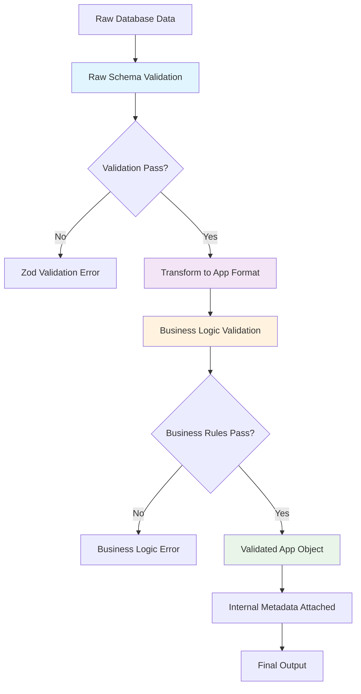
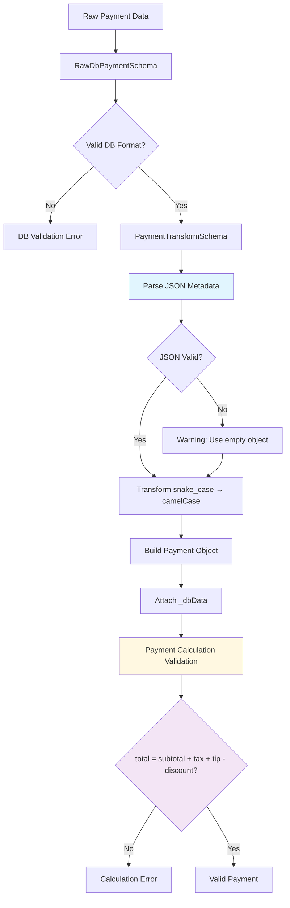
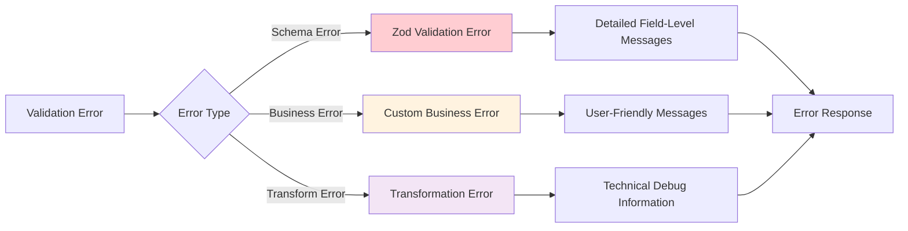

# Validation Flow Analysis - MyFarmstand Mobile Schema Architecture

## Overview
All three schema files (product.schema.ts, cart.schema.ts, payment.schema.ts) implement the **same core validation strategy** with identical architectural patterns but different complexity levels.

## Core Validation Strategy Pattern



## Schema Comparison Matrix

| Feature | Product | Cart | Payment |
|---------|---------|------|---------|
| **Raw DB Schema** | ✅ RawProductSchema | ✅ RawDbCartItemSchema | ✅ RawDbPaymentSchema |
| **Transformation** | ✅ ProductSchema.transform() | ✅ DbCartItemTransformSchema | ✅ PaymentTransformSchema |
| **Business Validation** | ✅ validateProductTransformation() | ✅ CartItemSchema.refine() | ✅ PaymentCalculationSchema.refine() |
| **Legacy Support** | ✅ DbProductSchema | ✅ DbCartItemSchema | ✅ DbPaymentSchema |
| **Array Schemas** | ✅ ProductArraySchema | ✅ CartItemArraySchema | ✅ PaymentArrayTransformSchema |
| **Request Schemas** | ❌ None | ✅ AddToCartRequestSchema | ✅ CreatePaymentRequestSchema |
| **Response Schemas** | ❌ None | ✅ CartOperationResponseSchema | ✅ PaymentOperationResponseSchema |

## Detailed Validation Flow Diagrams

### 1. Product Schema Flow
```mermaid
flowchart TD
    A[Database Product Row] --> B[RawProductSchema]
    B --> C{Valid DB Structure?}
    C -->|No| D[Zod Error: Invalid DB format]
    C -->|Yes| E[transformProductWithCategory()]
    E --> F[Transform snake_case → camelCase]
    F --> G[Populate Category Object]
    G --> H[validateProductTransformation()]
    H --> I{Category Bug Check}
    I -->|Bug Found| J[Critical Error: category_id mismatch]
    I -->|Valid| K{Category Populated?}
    K -->|No| L[Warning: Missing category]
    K -->|Yes| M[Product with Category]
    L --> N[Product without Category]
    M --> O[Final Product Object]
    N --> O
    
    style E fill:#e3f2fd
    style H fill:#fff8e1
    style I fill:#ffebee
```

### 2. Cart Schema Flow
```mermaid
flowchart TD
    A[Add to Cart Request] --> B[CartItemSchema]
    B --> C[ProductSchema Validation]
    C --> D{Product Valid?}
    D -->|No| E[Product Validation Error]
    D -->|Yes| F[Quantity Validation]
    F --> G{Quantity ≥ 1?}
    G -->|No| H[Quantity Error]
    G -->|Yes| I[Product Availability Check]
    I --> J{Product Available?}
    J -->|No| K[Unavailable Product Error]
    J -->|Yes| L[Stock Validation]
    L --> M{Stock Sufficient?}
    M -->|No| N[Insufficient Stock Error]
    M -->|Yes| O[Cart State Validation]
    O --> P[Total Calculation Check]
    P --> Q{Total = Σ(price × quantity)?}
    Q -->|No| R[Total Calculation Error]
    Q -->|Yes| S[Valid Cart State]
    
    style I fill:#e8f5e8
    style L fill:#fff3e0
    style P fill:#f3e5f5
```

### 3. Payment Schema Flow


## Key Architectural Patterns

### 1. Database-First Validation
```typescript
// Pattern: Raw DB schema validates exact database structure
const RawDbSchema = z.object({
  field_name: z.string(),  // snake_case from database
  // ... other DB fields
});
```

### 2. Single-Pass Transformation
```typescript
// Pattern: Transform while validating (efficiency + type safety)
export const TransformSchema = RawDbSchema.transform((data): AppType => ({
  fieldName: data.field_name,  // snake_case → camelCase
  // ... transformation logic
}));
```

### 3. Business Logic Validation
```typescript
// Pattern: Custom validation after structural validation
.refine((data) => {
  // Business rule validation
  return businessRuleCheck(data);
}, {
  message: "Business rule violation",
  path: ["field"]
});
```

### 4. Internal Metadata Pattern
```typescript
// Pattern: Attach debug/monitoring data
return {
  ...appFormatData,
  _dbData: {
    originalField: data.original_field,
    rawMetadata: data.metadata,
    // ... debugging info
  }
};
```

## Validation Strategy Benefits

### 1. **Data Integrity** 
- Database structure enforced at schema level
- Business rules validated separately
- No invalid data reaches application layer

### 2. **Performance**
- Single validation pass with transformation
- Early error detection and reporting
- Minimal data processing overhead

### 3. **Type Safety**
- Full TypeScript integration
- Compile-time type checking
- Runtime validation alignment

### 4. **Debugging**
- Internal metadata for troubleshooting
- Clear error messages with context
- Validation monitoring capabilities

### 5. **Backward Compatibility**
- Legacy schema exports maintained
- Gradual migration support
- No breaking changes to existing code

## Error Handling Strategy



## Conclusion

All three schemas implement an **identical validation architecture** with:
- ✅ Database-first validation
- ✅ Single-pass transformation 
- ✅ Business logic validation
- ✅ Internal metadata attachment
- ✅ Legacy compatibility support

The only differences are in **complexity levels**:
- **Product**: Complex category relationship handling
- **Cart**: Multi-level business rule validation
- **Payment**: Complex financial calculation validation

This consistent pattern ensures maintainable, reliable, and performant data validation across the entire application.