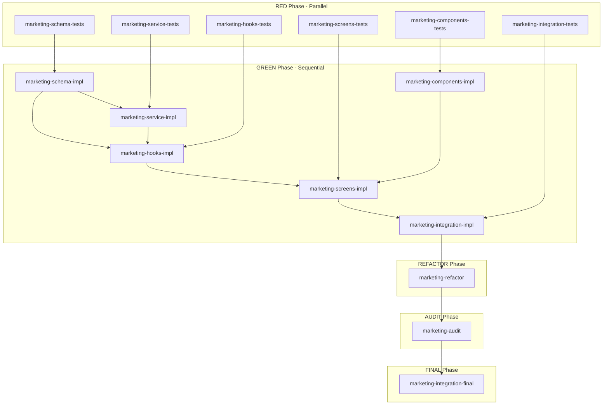

# Phase 3 Marketing Operations - Agent Communication Flow & Dependency Analysis

## 🚨 CRITICAL GAPS DISCOVERED

### 1. Missing Implementation Agents
- ❌ **NO marketing-schema-impl agent** (schemas have tests but no implementer)
- ❌ **NO marketing-service-impl agent** (services have tests but no implementer)

### 2. Communication File Inconsistencies
- Status files use inconsistent naming conventions
- Handoff protocols between phases are undefined
- Blocker escalation path is missing

### 3. Dependency Issues
- Hooks and components can't be implemented without schemas/services
- Integration depends on services that won't be implemented

## 📊 Complete Communication Flow Matrix

### Status Files (Standardized)
Each agent writes to a consistent status file:

| Agent | Status File | Content |
|-------|------------|---------|
| marketing-schema-tests | `/communication/status/marketing-schema-tests.json` | `{"phase": "RED", "tests_written": 7, "total": 7}` |
| marketing-service-tests | `/communication/status/marketing-service-tests.json` | `{"phase": "RED", "tests_written": 7, "total": 7}` |
| marketing-hooks-tests | `/communication/status/marketing-hooks-tests.json` | `{"phase": "RED", "tests_written": 40, "total": 40}` |
| marketing-screens-tests | `/communication/status/marketing-screens-tests.json` | `{"phase": "RED", "tests_written": 120, "total": 120}` |
| marketing-components-tests | `/communication/status/marketing-components-tests.json` | `{"phase": "RED", "tests_written": 45, "total": 45}` |
| marketing-integration-tests | `/communication/status/marketing-integration-tests.json` | `{"phase": "RED", "tests_written": 55, "total": 55}` |
| marketing-schema-impl | `/communication/status/marketing-schema-impl.json` | `{"phase": "GREEN", "passing": 7, "total": 7}` |
| marketing-service-impl | `/communication/status/marketing-service-impl.json` | `{"phase": "GREEN", "passing": 7, "total": 7}` |
| marketing-hooks-impl | `/communication/status/marketing-hooks-impl.json` | `{"phase": "GREEN", "passing": 40, "total": 40}` |
| marketing-components-impl | `/communication/status/marketing-components-impl.json` | `{"phase": "GREEN", "passing": 45, "total": 45}` |
| marketing-screens-impl | `/communication/status/marketing-screens-impl.json` | `{"phase": "GREEN", "passing": 120, "total": 120}` |
| marketing-integration-impl | `/communication/status/marketing-integration-impl.json` | `{"phase": "GREEN", "passing": 55, "total": 55}` |
| marketing-refactor | `/communication/status/marketing-refactor.json` | `{"phase": "REFACTOR", "optimizations": 15, "complete": true}` |
| marketing-audit | `/communication/status/marketing-audit.json` | `{"phase": "AUDIT", "violations": 0, "complete": true}` |
| marketing-integration-final | `/communication/status/marketing-integration-final.json` | `{"phase": "FINAL", "all_tests": 284, "passing": 284}` |

### Handoff Files (Phase Transitions)

| From Phase | To Phase | Handoff File | Content |
|------------|----------|--------------|---------|
| RED (all test writers) | GREEN | `/communication/handoffs/red-complete.md` | Test summary, counts, patterns used |
| GREEN (all implementers) | REFACTOR | `/communication/handoffs/green-complete.md` | Implementation summary, test results |
| REFACTOR | AUDIT | `/communication/handoffs/refactor-complete.md` | Optimizations made, performance gains |
| AUDIT | FINAL | `/communication/handoffs/audit-complete.md` | Compliance report, violations fixed |

### Blocker Files (Issue Escalation)

| Agent | Blocker File | Read By |
|-------|-------------|---------|
| Any RED agent | `/communication/blockers/[agent-name].md` | Orchestrator/Human |
| Any GREEN agent | `/communication/blockers/[agent-name].md` | Dependent agents + Orchestrator |
| REFACTOR | `/communication/blockers/refactor.md` | AUDIT agent |
| AUDIT | `/communication/blockers/audit.md` | FINAL agent |

### Progress Files (Detailed Logs)

| Agent | Progress File | Update Frequency |
|-------|--------------|------------------|
| All agents | `/communication/progress/[agent-name].md` | Every 10 tests or major milestone |

## 🔄 Corrected Dependency Graph



## 📝 Required Configuration Updates

### 1. Add Missing Agents to Config

```yaml
# Add after marketing-service-tests
- name: "marketing-schema-impl"
  type: "implementer"
  phase: "GREEN"
  depends_on: ["marketing-schema-tests"]
  test_command: "npm run test:schemas:marketing"
  prompt_file: "phase3-marketing-schema-impl.md"

- name: "marketing-service-impl"
  type: "implementer"
  phase: "GREEN"
  depends_on: ["marketing-service-tests", "marketing-schema-impl"]
  test_command: "npm run test:services:marketing"
  prompt_file: "phase3-marketing-service-impl.md"
```

### 2. Update Dependencies

```yaml
# Update marketing-hooks-impl
- name: "marketing-hooks-impl"
  type: "implementer"
  phase: "GREEN"
  depends_on: ["marketing-hooks-tests", "marketing-service-impl"]  # Add service dependency
  test_command: "npm run test:hooks:marketing"
  prompt_file: "phase3-marketing-hooks-impl.md"
```

## 🔐 Communication Protocol Standards

### 1. Status Update Protocol
```bash
# Every agent must update status every 60 seconds
while true; do
    STATUS=$(calculate_status)
    echo "$STATUS" > /communication/status/${AGENT_NAME}.json
    sleep 60
done
```

### 2. Handoff Protocol
```bash
# When phase completes
if [ "$ALL_TESTS_PASSING" = "true" ]; then
    echo "Phase complete: $(date)" > /communication/handoffs/${PHASE}-complete.md
    echo "Tests: ${PASSING}/${TOTAL}" >> /communication/handoffs/${PHASE}-complete.md
fi
```

### 3. Blocker Protocol
```bash
# When blocked
if [ "$BLOCKED" = "true" ]; then
    echo "BLOCKED: ${REASON}" > /communication/blockers/${AGENT_NAME}.md
    echo "Time: $(date)" >> /communication/blockers/${AGENT_NAME}.md
    echo "Requires: ${DEPENDENCY}" >> /communication/blockers/${AGENT_NAME}.md
fi
```

### 4. Progress Protocol
```bash
# Every 10 tests or milestone
if [ $((TEST_COUNT % 10)) -eq 0 ]; then
    echo "## Progress Update: $(date)" >> /communication/progress/${AGENT_NAME}.md
    echo "- Tests completed: ${TEST_COUNT}" >> /communication/progress/${AGENT_NAME}.md
    echo "- Current task: ${CURRENT_TASK}" >> /communication/progress/${AGENT_NAME}.md
fi
```

## 🎯 Communication Best Practices

### 1. File Locking
```bash
# Use flock to prevent race conditions
(
    flock -x 200
    echo "$STATUS" > /communication/status/${AGENT_NAME}.json
) 200>/communication/locks/${AGENT_NAME}.lock
```

### 2. Atomic Writes
```bash
# Write to temp file first
echo "$STATUS" > /communication/status/${AGENT_NAME}.json.tmp
mv /communication/status/${AGENT_NAME}.json.tmp /communication/status/${AGENT_NAME}.json
```

### 3. Health Checks
```bash
# Each agent should check dependencies
for DEP in ${DEPENDENCIES[@]}; do
    if [ ! -f "/communication/handoffs/${DEP}-complete.md" ]; then
        echo "Waiting for ${DEP}..."
        sleep 30
    fi
done
```

## 🚀 Implementation Actions Required

1. **Create missing agent prompts**:
   - [ ] phase3-marketing-schema-impl.md
   - [ ] phase3-marketing-service-impl.md

2. **Update existing prompts** to use consistent communication paths:
   - [ ] All status files should use full agent names
   - [ ] All agents should write handoff files
   - [ ] All agents should check for blockers

3. **Update config file** with missing agents and corrected dependencies

4. **Create orchestrator script** to monitor all agents and handle escalations

## 📊 Expected Communication Volume

### Per Minute:
- Status updates: 15 agents × 1 update = 15 files
- Progress updates: ~2-3 files
- Blocker checks: 15 agents × 1 check = 15 reads

### Per Phase:
- Handoff files: 1 per phase = 5 files total
- Blocker files: 0-5 (ideally 0)
- Final artifacts: ~300 test files, ~50 implementation files

## 🔒 Data Integrity Requirements

1. **All communication files must be JSON formatted** (except .md progress/handoff files)
2. **Use timestamps in ISO 8601 format**
3. **Include agent name and phase in every message**
4. **Use atomic writes to prevent corruption**
5. **Implement retry logic for failed writes**

This communication flow ensures proper coordination between all agents and provides visibility into the entire TDD process.