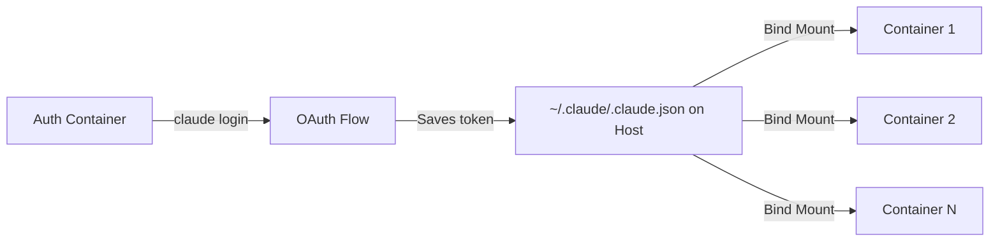

# Claude Code Multi-Agent Docker Authentication Pattern

## Problem Statement

When running multiple Claude Code CLI instances in Docker containers for a multi-agent system, each container typically requires individual authentication via browser-based OAuth flow. This creates a significant operational burden when managing many agents.

## Solution: Shared Authentication via Bind Mount

This pattern allows authenticating Claude Code CLI once and sharing that authentication across all containerized agents through Docker volume mounts.

## How It Works

### 1. Authentication Storage Discovery

Claude Code CLI stores OAuth authentication in `/home/[user]/.claude.json` after successful `claude login`. This file contains the OAuth token and account information.

### 2. Volume Mount Strategy

By mounting the host's `~/.claude` directory to each container's `/home/agent/.claude`, all containers share the same authentication state:

```yaml
volumes:
  - ~/.claude:/home/agent/.claude:rw
```

### 3. Authentication Flow



## Implementation

### Step 1: Docker Compose Configuration

```yaml
# docker-compose.yml
services:
  agent-1:
    image: your-claude-agent-image
    volumes:
      - ~/.claude:/home/agent/.claude:rw  # Shared auth mount
      - ./workspace:/workspace:rw
    environment:
      - CLAUDE_CONFIG_DIR=/home/agent/.claude
      
  agent-2:
    image: your-claude-agent-image
    volumes:
      - ~/.claude:/home/agent/.claude:rw  # Same mount
      - ./workspace:/workspace:rw
    environment:
      - CLAUDE_CONFIG_DIR=/home/agent/.claude
```

### Step 2: Entrypoint with Auth Check

Create an entrypoint that checks authentication before running Claude:

```bash
#!/bin/bash
# entrypoint.sh

# Check authentication status FIRST
echo "🔐 Checking Claude authentication status..."
AUTH_CHECK=$(echo "test" | claude --dangerously-skip-permissions -p "Say yes" 2>&1)

if echo "$AUTH_CHECK" | grep -q "Invalid API key"; then
    echo "⚠️  CLAUDE AUTHENTICATION REQUIRED!"
    echo "⚠️  Container: ${HOSTNAME}"
    echo "⚠️  TO AUTHENTICATE:"
    echo "⚠️  1. docker exec -it ${HOSTNAME} /bin/bash"
    echo "⚠️  2. claude login"
    echo "⚠️  3. Complete browser authentication"
    
    # Wait for authentication
    while true; do
        echo "⏳ Waiting for authentication..."
        sleep 30
        
        if echo "test" | claude --dangerously-skip-permissions -p "Say yes" 2>&1 | grep -qi "yes"; then
            echo "✅ Authentication successful!"
            break
        fi
    done
else
    echo "✅ Claude is already authenticated"
fi

# Now run Claude with your prompt
claude --dangerously-skip-permissions -p "$PROMPT"
```

### Step 3: One-Time Authentication Process

1. **Create a temporary auth container:**
```bash
docker run -it --rm \
  -v ~/.claude:/home/agent/.claude:rw \
  your-claude-agent-image \
  /bin/bash
```

2. **Authenticate once:**
```bash
claude login
# Follow browser OAuth flow
```

3. **Start all agent containers:**
```bash
docker-compose up -d
```

All containers will detect the shared authentication and proceed without requiring individual login.

## Key Insights

### Why This Works

1. **OAuth Token Persistence**: Claude Code stores the OAuth token in a JSON file that persists between sessions
2. **Filesystem Sharing**: Docker bind mounts allow multiple containers to read the same file simultaneously
3. **No Token Copying**: The token isn't copied between containers; they all read the same source file
4. **CLAUDE_CONFIG_DIR**: Environment variable tells Claude where to look for configuration

### Security Considerations

- ✅ **Single Authentication Point**: Reduces attack surface compared to multiple auth sessions
- ✅ **Container Isolation**: Each container still runs in isolation, only sharing the auth file
- ⚠️ **Shared Session**: All containers use the same Claude session/account
- ⚠️ **Host Dependency**: Authentication depends on host filesystem

### Advantages

1. **Operational Efficiency**: Login once instead of N times for N agents
2. **Persistent Auth**: Survives container restarts
3. **Simple Setup**: Just a volume mount, no complex token distribution
4. **Immediate Updates**: Auth changes instantly reflected across all containers

### Limitations

1. **Same Account**: All agents use the same Claude account
2. **Concurrent Limits**: Subject to account's concurrent session limits
3. **Shared Rate Limits**: All containers share the same rate limit pool

## Troubleshooting

### Containers Not Detecting Auth

**Check mount is correct:**
```bash
docker exec [container] ls -la /home/agent/.claude/
```

**Verify auth file exists:**
```bash
ls -la ~/.claude/.claude.json
```

**Check environment variable:**
```bash
docker exec [container] env | grep CLAUDE_CONFIG_DIR
```

### Auth File Not Created

Ensure the directory exists before first login:
```bash
mkdir -p ~/.claude
```

### Permission Issues

Ensure the container user has read/write access:
```yaml
volumes:
  - ~/.claude:/home/agent/.claude:rw  # Note: rw not ro
```

## Complete Example

### Dockerfile
```dockerfile
FROM node:20-bullseye

# Install Claude Code CLI
RUN npm install -g @anthropic-ai/claude-code@latest

# Create agent user
RUN useradd -m -s /bin/bash agent
USER agent

# Set Claude config directory
ENV CLAUDE_CONFIG_DIR="/home/agent/.claude"

WORKDIR /workspace
ENTRYPOINT ["/entrypoint.sh"]
```

### docker-compose.yml
```yaml
version: '3.8'

services:
  auth-agent:
    build: .
    container_name: auth-agent
    volumes:
      - ~/.claude:/home/agent/.claude:rw
    entrypoint: sleep 3600  # Keep alive for auth
    
  worker-agent-1:
    build: .
    volumes:
      - ~/.claude:/home/agent/.claude:rw
      - ./workspace:/workspace:rw
    depends_on:
      - auth-agent
      
  worker-agent-2:
    build: .
    volumes:
      - ~/.claude:/home/agent/.claude:rw
      - ./workspace:/workspace:rw
    depends_on:
      - auth-agent
```

### Authentication Script
```bash
#!/bin/bash
# authenticate-agents.sh

echo "🔐 Authenticating Claude agents..."

# Start auth container
docker-compose up -d auth-agent

# Authenticate
echo "Running claude login in auth container..."
docker exec -it auth-agent claude login

# Test authentication
if docker exec auth-agent sh -c 'echo "test" | claude -p "Say authenticated"' | grep -q "authenticated"; then
    echo "✅ Authentication successful!"
    
    # Start worker agents
    docker-compose up -d worker-agent-1 worker-agent-2
    echo "✅ All agents started with shared authentication"
else
    echo "❌ Authentication failed"
fi
```

## Conclusion

This pattern enables efficient multi-agent Claude Code deployments by solving the authentication bottleneck. Instead of manual OAuth flow for each container, authenticate once and share via filesystem mounts. This approach maintains security while dramatically improving operational efficiency for multi-agent systems.

## Credits

Pattern discovered and documented through experimentation with containerized Claude Code CLI agents. Not documented in official Claude or Docker documentation as of August 2025.