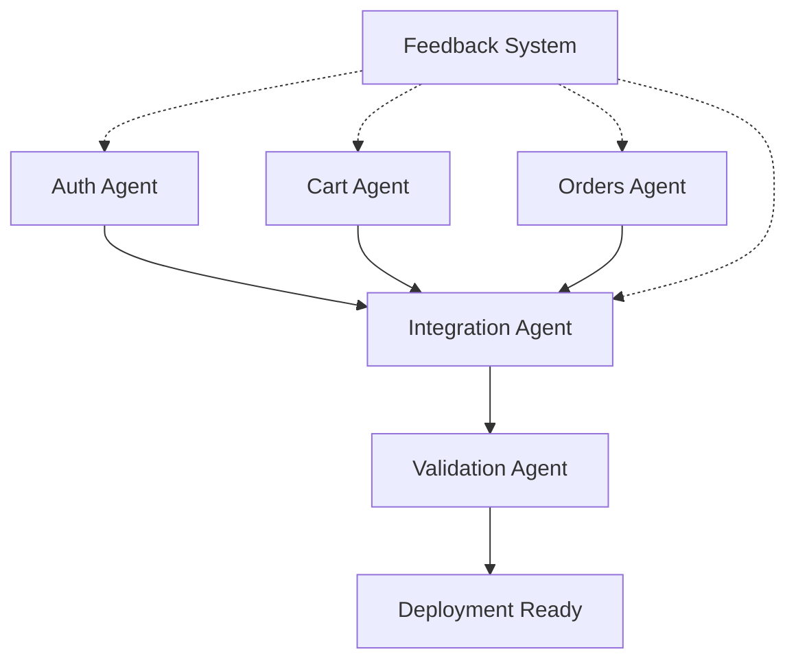

# Multi-Agent Integration and Restoration: Lessons Learned

## Executive Summary
This document captures critical learnings from implementing TDD Phase 4 restoration, focusing on multi-agent coordination, test infrastructure harmonization, and integration challenges. These patterns are essential for scaling development across multiple autonomous agents.

## Table of Contents
1. [Core Problems Discovered](#core-problems-discovered)
2. [Successful Patterns](#successful-patterns)
3. [Prompt Engineering for Integration](#prompt-engineering-for-integration)
4. [Multi-Agent Architecture](#multi-agent-architecture)
5. [Test Infrastructure Harmonization](#test-infrastructure-harmonization)
6. [Communication Patterns](#communication-patterns)
7. [Failure Recovery Strategies](#failure-recovery-strategies)
8. [Implementation Checklist](#implementation-checklist)

## Core Problems Discovered

### 1. Verification Command Mismatch
**Problem**: Agent achieved 74% pass rate but entrypoint expected non-existent `test:all:executive` script
**Root Cause**: Hardcoded TEST_COMMAND in docker-compose.yml didn't match available scripts
**Solution**: Explicitly specify required test scripts in prompts with exact names and implementations

### 2. Environment Variable Scope
**Problem**: PROJECT_NAME and AGENT_NAME not available in Claude's bash subprocesses
**Root Cause**: Variables not exported in entrypoint scripts
**Solution**: Add export statements for all critical environment variables
```bash
export PROJECT_NAME="${PROJECT_NAME}"
export AGENT_NAME="${AGENT_NAME}"
export TEST_COMMAND="${TEST_COMMAND}"
```

### 3. Code vs Infrastructure Confusion
**Problem**: Agent repeatedly copying source code when only test infrastructure needed fixing
**Root Cause**: Prompt didn't clearly distinguish between code migration and infrastructure harmonization
**Solution**: Explicit sections for "What's Already Done" and "What Needs Fixing"

### 4. Feedback Loop Delay
**Problem**: Agent continued with wrong approach for 30+ minutes before correction
**Root Cause**: No real-time feedback mechanism
**Solution**: External feedback file checked at start of each cycle

## Successful Patterns

### 1. Baseline Verification First
Always verify source state before attempting integration:
```bash
# BEFORE migration - capture source metrics
for volume in /reference/tdd_phase_4-*; do
  cd "$volume" && npm test 2>&1 | grep "Test Suites:"
  echo "Volume $volume: Pass rate captured"
done
```

### 2. External Feedback System
Implement feedback file checking at cycle start:
```bash
FEEDBACK_FILE="/shared/feedback/${PROJECT_NAME}-${AGENT_NAME}-improvements.md"
if [ -f "$FEEDBACK_FILE" ]; then
  echo "📋 PRIORITY: Implementing feedback..."
  cat "$FEEDBACK_FILE"
  # Adjust approach based on feedback
fi
```

### 3. Explicit File Enumeration
Instead of wildcards, enumerate critical files:
```json
{
  "required_test_scripts": [
    "test:integration:cross-role",
    "test:features:decision",
    "test:components:executive",
    "test:hooks:executive",
    "test:screens:executive"
  ],
  "required_configs": [
    "jest.config.integration.cross-role.js",
    "jest.config.decision.js",
    "jest.config.components.executive.js",
    "jest.config.hooks.executive.js",
    "jest.config.screens.executive.js"
  ]
}
```

## Prompt Engineering for Integration

### Structure Template
```markdown
# [Agent Type] Agent - [Specific Task]

## CRITICAL CONTEXT (READ FIRST)
- What already exists: [explicit list]
- What you must NOT do: [explicit list]
- What you MUST do: [explicit list]

## VERIFICATION GATES
1. Pre-integration checks
2. Post-integration validation
3. Success criteria with numbers

## EXPLICIT REQUIREMENTS
[Exact commands, file names, script definitions]

## FEEDBACK INTEGRATION
Check: /shared/feedback/[specific-file-name]
```

### Integration Agent Specific Requirements

#### 1. Source Inventory
```markdown
## Available Sources
| Source | Location | Status | Pass Rate |
|--------|----------|--------|-----------|
| Auth Module | /sources/auth-agent | Complete | 98% |
| Cart Module | /sources/cart-agent | Complete | 95% |
| Orders Module | /sources/orders-agent | In Progress | 72% |
```

#### 2. Conflict Resolution Matrix
```markdown
## Potential Conflicts and Resolution
| Conflict Type | Detection Method | Resolution Strategy |
|--------------|------------------|-------------------|
| Mock implementations | Compare /src/__mocks__ | Namespace by domain |
| Test scripts | Check package.json | Prefix with domain |
| Jest configs | List all jest.config*.js | Create unified config |
| Dependencies | Compare versions | Use highest compatible |
```

## Multi-Agent Architecture

### Recommended Structure
```yaml
project:
  development_agents:
    - name: auth-agent
      workspace: /volumes/auth-workspace
      output: /sources/auth-complete
      
    - name: cart-agent
      workspace: /volumes/cart-workspace
      output: /sources/cart-complete
      
    - name: orders-agent
      workspace: /volumes/orders-workspace
      output: /sources/orders-complete
      
  integration_agent:
    name: integration-agent
    sources: /sources/*-complete
    workspace: /volumes/integrated-workspace
    validation: /shared/validation-results
    
  coordination:
    handoffs: /shared/handoffs/
    feedback: /shared/feedback/
    status: /shared/status/
```

### Agent Dependencies


## Test Infrastructure Harmonization

### Key Components to Harmonize

#### 1. Jest Configurations
```javascript
// Unified jest.config.js template
module.exports = {
  projects: [
    '<rootDir>/jest.config.auth.js',
    '<rootDir>/jest.config.cart.js',
    '<rootDir>/jest.config.orders.js',
  ],
  coverageDirectory: '<rootDir>/coverage-all',
  collectCoverageFrom: [
    'src/**/*.{ts,tsx}',
    '!src/**/*.test.{ts,tsx}',
  ],
};
```

#### 2. Package.json Scripts
```json
{
  "scripts": {
    "test": "jest",
    "test:all": "jest --projects",
    "test:auth": "jest --selectProjects auth",
    "test:cart": "jest --selectProjects cart",
    "test:orders": "jest --selectProjects orders",
    "test:integration": "jest --selectProjects integration",
    "test:ci": "npm run test:all -- --coverage --maxWorkers=2"
  }
}
```

#### 3. Mock Organization
```
src/
  __mocks__/
    @supabase/          # Shared external mocks
    auth/               # Auth-specific mocks
      authService.ts
    cart/               # Cart-specific mocks
      cartService.ts
    orders/             # Order-specific mocks
      orderService.ts
    shared/             # Shared internal mocks
      testUtils.ts
```

## Communication Patterns

### 1. Status Broadcasting
```json
// /shared/status/auth-agent-status.json
{
  "agent": "auth-agent",
  "timestamp": "2025-09-10T01:00:00Z",
  "phase": "testing",
  "metrics": {
    "files_created": 45,
    "tests_written": 128,
    "pass_rate": 98.2,
    "coverage": 87.5
  },
  "ready_for_integration": true,
  "blocking_issues": [],
  "notes": "Ready for integration. All tests passing."
}
```

### 2. Handoff Protocol
```markdown
# Handoff: auth-agent → integration-agent
Date: 2025-09-10T01:00:00Z

## Deliverables
- Source files: 45 files in src/auth/
- Test files: 128 tests in src/auth/__tests__/
- Coverage: 87.5%
- Pass rate: 98.2%

## Integration Notes
- Requires user-service@2.0.0
- Exports AuthContext for cart integration
- Mock setup requires Firebase config

## Known Issues
- Token refresh test flaky on CI (marked as skip)

## Test Commands
- Unit: npm run test:auth:unit
- Integration: npm run test:auth:integration
- E2E: npm run test:auth:e2e
```

### 3. Feedback Loop
```markdown
# Feedback for: integration-agent
From: monitoring-system
Priority: HIGH

## Issue Detected
Test pass rate dropped from 95% to 72% after cart integration

## Root Cause
Mock conflict between auth and cart services

## Required Action
1. Namespace mocks: auth mocks in src/__mocks__/auth/
2. Update cart tests to use namespaced mocks
3. Re-run integration tests

## Validation
After fix, run: npm run test:cart -- --clearCache
```

## Failure Recovery Strategies

### 1. Rollback Triggers
```bash
# Automatic rollback on integration failure
if [ $PASS_RATE -lt $MINIMUM_PASS_RATE ]; then
  echo "❌ Pass rate $PASS_RATE% below minimum $MINIMUM_PASS_RATE%"
  git stash
  git checkout last-known-good
  echo "📝 Creating failure report..."
  create_failure_report > /shared/failures/integration-$(date +%s).md
fi
```

### 2. Incremental Integration
```bash
# Don't integrate everything at once
INTEGRATION_ORDER=("auth" "cart" "orders" "payments")
for module in "${INTEGRATION_ORDER[@]}"; do
  integrate_module "$module"
  run_tests "$module"
  if [ $? -ne 0 ]; then
    echo "❌ Integration failed at $module"
    rollback_module "$module"
    exit 1
  fi
  echo "✅ $module integrated successfully"
done
```

### 3. Conflict Resolution Patterns
```typescript
// Pattern 1: Mock Namespacing
const authMock = require('./__mocks__/auth/authService');
const cartMock = require('./__mocks__/cart/cartService');

// Pattern 2: Test Isolation
beforeEach(() => {
  jest.clearAllMocks();
  jest.resetModules();
});

// Pattern 3: Explicit Cleanup
afterEach(() => {
  cleanup();
  jest.restoreAllMocks();
});
```

## Implementation Checklist

### For Development Agents
- [ ] Export all work to designated output directory
- [ ] Include comprehensive test suite
- [ ] Document all external dependencies
- [ ] Create handoff document
- [ ] Update status file
- [ ] Achieve minimum 85% pass rate
- [ ] Achieve minimum 70% coverage

### For Integration Agent
- [ ] Verify all source agents complete
- [ ] Check dependency compatibility
- [ ] Create integration plan
- [ ] Backup current state
- [ ] Integrate in dependency order
- [ ] Harmonize test infrastructure
- [ ] Run validation suite
- [ ] Generate integration report
- [ ] Update combined metrics

### For Monitoring/Validation
- [ ] Track pass rates per module
- [ ] Monitor integration progress
- [ ] Detect conflicts early
- [ ] Generate feedback files
- [ ] Alert on failures
- [ ] Create recovery snapshots

## Best Practices Summary

1. **Explicit Over Implicit**: Always specify exact files, commands, and expected outcomes
2. **Verify Before Integrate**: Check source quality before attempting integration
3. **Incremental Progress**: Integrate one module at a time with validation gates
4. **Namespace Everything**: Prevent conflicts through clear separation
5. **Feedback Loops**: Implement real-time correction mechanisms
6. **Rollback Ready**: Always have a way to revert failed integrations
7. **Document Handoffs**: Clear communication between agents is critical
8. **Test the Tests**: Ensure test infrastructure itself is valid
9. **Monitor Continuously**: Don't wait for final validation to detect issues
10. **Learn and Adapt**: Update prompts based on failure patterns

## Conclusion

Successful multi-agent development requires:
- Clear separation of concerns
- Explicit communication protocols
- Robust integration strategies
- Comprehensive validation gates
- Real-time feedback mechanisms

The key insight is that integration agents need significantly more detailed instructions than development agents, as they must handle the complexity of merging multiple codebases while maintaining quality and consistency.

## References
- [TDD Phase 4 Restoration Session Logs](../docker/volumes/communication/progress/)
- [Agent Prompt Guidelines](./agent-prompt-structure-guidelines.md)
- [Architectural Patterns](./architectural-patterns-and-best-practices.md)