# Commit Gate Workflow - Role-Based Implementation
**Test-First with Architectural Compliance Enforcement**

## 🚦 **Mandatory Development Workflow**

### **Every Development Cycle MUST Follow This Sequence**

```mermaid
graph TD
    A[Write Test First] --> B[Run Test → RED]
    B --> C[Write Minimal Code]
    C --> D[Run Test → GREEN]
    D --> E[Refactor if Needed]
    E --> F[Run ALL Module Tests]
    F --> G[Run Schema Contracts]
    G --> H[Run Pattern Validation]
    H --> I{All Gates Pass?}
    I -->|Yes| J[Commit Allowed]
    I -->|No| K[Fix Issues]
    K --> F
    J --> L[Continue Next Feature]
```



---

## 🧪 **Test-First Development Rules**

### **1. Red-Green-Refactor Cycle (MANDATORY)**
```bash
# Step 1: Write failing test
npm test specific-test.test.ts    # ❌ RED (expected failure)

# Step 2: Write minimal implementation 
# Code just enough to make test pass

# Step 3: Run test again
npm test specific-test.test.ts    # ✅ GREEN (test passes)

# Step 4: Refactor (if needed)
# Improve code without changing behavior

# Step 5: Run all related tests
npm test module/                  # ✅ All tests still pass
```

### **2. No Implementation Without Test**
❌ **FORBIDDEN:**
- Writing service methods without tests
- Creating hooks without test coverage
- Adding schema transformations without validation
- Implementing features "quickly" without TDD

✅ **REQUIRED:**
- Test written first, implementation second
- Every method has corresponding test
- Edge cases covered with tests
- Error scenarios tested before implementation

---

## 🔒 **Commit Gate System**

### **Gate 1: Schema Contract Validation**
```bash
# Automatic validation (pre-commit hook)
echo "🔧 Schema contract validation..."
npx tsc --noEmit src/schemas/role-based/__contracts__/*.test.ts

# Result handling:
# ✅ PASS → Continue to Gate 2
# ❌ FAIL → Commit BLOCKED
#          Fix TypeScript errors first
#          Re-run until green
```

**What This Catches:**
- Missing interface fields in transformations
- Wrong database field mappings
- Type mismatches between database and app
- Incomplete schema implementations

### **Gate 2: Architectural Pattern Validation**
```bash
echo "🏗️ Pattern validation..."
npm run validate:role-patterns

# Checks:
# - No dual query key systems
# - ValidationMonitor integration present  
# - Resilient processing patterns used
# - Direct Supabase field selection
```

**What This Catches:**
- Dual query key factory systems (anti-pattern)
- Missing ValidationMonitor integration
- Non-resilient processing (all-or-nothing failures)
- Wrong database field selections

### **Gate 3: Service Layer Testing**
```bash
echo "🧪 Service layer validation..."
npm run test:services:role-based

# Requirements:
# - All service tests pass (15+ tests minimum)
# - Error scenarios covered
# - ValidationMonitor usage verified
# - Resilient processing tested
```

**What This Catches:**
- Service method failures
- Error handling gaps
- Missing monitoring integration
- Broken resilient processing

### **Gate 4: Hook Layer Testing**
```bash
echo "🎣 Hook layer validation..."  
npm run test:hooks:role-based

# Requirements:
# - All hook tests pass (20+ tests minimum)
# - React Query integration verified
# - Query key factory usage correct
# - Cache behavior validated
```

**What This Catches:**
- Hook implementation bugs
- React Query misusage
- Query key inconsistencies
- Cache invalidation issues

### **Gate 5: Integration Testing**
```bash
echo "🔗 Integration validation..."
npm run test:integration:role-based

# Requirements:
# - End-to-end workflows pass
# - Cross-layer integration verified
# - Permission enforcement working
# - Database operations successful
```

**What This Catches:**
- Service-hook integration failures
- Permission system bugs
- Database constraint violations
- Workflow breakdowns

### **Gate 6: TypeScript Compilation**
```bash
echo "📝 TypeScript validation..."
npx tsc --noEmit --strict

# Requirements:
# - Zero TypeScript errors
# - Strict mode compliance
# - No `any` types
# - Complete type safety
```

**What This Catches:**
- Type safety violations
- Missing return types
- Unsafe type assertions
- Incomplete interfaces

---

## 🚫 **Commit Blocking Conditions**

### **Automatic Commit Prevention:**
- ❌ Any test failure in affected modules
- ❌ TypeScript compilation errors
- ❌ Schema contract violations  
- ❌ Pattern validation failures
- ❌ Missing ValidationMonitor integration
- ❌ Dual query key systems detected
- ❌ Non-resilient processing patterns

### **Manual Review Required:**
- ⚠️ Test coverage below 90% in affected files
- ⚠️ Complex logic without corresponding tests
- ⚠️ New patterns not following existing architecture
- ⚠️ Performance implications in critical paths

---

## 📝 **Pre-Commit Hook Implementation**

### **Enhanced .husky/pre-commit**
```bash
#!/usr/bin/env sh
. "$(dirname -- "$0")/_/husky.sh"

echo "🚦 Role-based architecture commit gates..."

# Gate 1: Schema Contracts
echo "🔧 Validating schema contracts..."
npx tsc --noEmit src/schemas/role-based/__contracts__/*.test.ts
if [ $? -ne 0 ]; then
  echo "❌ COMMIT BLOCKED: Schema contracts failed"
  echo "   Fix TypeScript errors in schema contracts"
  echo "   Run: npx tsc --noEmit src/schemas/role-based/__contracts__/*.test.ts"
  exit 1
fi

# Gate 2: Pattern Validation  
echo "🏗️ Validating architectural patterns..."
npm run validate:role-patterns
if [ $? -ne 0 ]; then
  echo "❌ COMMIT BLOCKED: Pattern validation failed"
  echo "   Fix architectural pattern violations"
  echo "   Run: npm run validate:role-patterns"
  exit 1
fi

# Gate 3: Service Tests
echo "🧪 Running service layer tests..."
npm run test:services:role-based --silent
if [ $? -ne 0 ]; then
  echo "❌ COMMIT BLOCKED: Service tests failed"
  echo "   Fix failing service tests"
  echo "   Run: npm run test:services:role-based"
  exit 1
fi

# Gate 4: Hook Tests
echo "🎣 Running hook layer tests..."
npm run test:hooks:role-based --silent
if [ $? -ne 0 ]; then
  echo "❌ COMMIT BLOCKED: Hook tests failed"
  echo "   Fix failing hook tests"
  echo "   Run: npm run test:hooks:role-based"
  exit 1
fi

# Gate 5: Integration Tests
echo "🔗 Running integration tests..."
npm run test:integration:role-based --silent
if [ $? -ne 0 ]; then
  echo "❌ COMMIT BLOCKED: Integration tests failed"
  echo "   Fix failing integration tests"
  echo "   Run: npm run test:integration:role-based"
  exit 1
fi

# Gate 6: TypeScript
echo "📝 Validating TypeScript..."
npx tsc --noEmit --strict
if [ $? -ne 0 ]; then
  echo "❌ COMMIT BLOCKED: TypeScript errors"
  echo "   Fix TypeScript compilation errors"
  echo "   Run: npx tsc --noEmit --strict"
  exit 1
fi

echo "✅ All commit gates passed - commit allowed"
echo "🎉 Role-based architecture integrity maintained"
```

---

## 🛠️ **Package.json Scripts**

### **Required Test Scripts**
```json
{
  "scripts": {
    "test:services:role-based": "jest src/services/role-based/ --coverage",
    "test:hooks:role-based": "jest src/hooks/role-based/ --coverage", 
    "test:integration:role-based": "jest src/role-based/__tests__/integration/",
    "test:role-based:all": "jest --testPathPattern=role-based --coverage",
    
    "validate:role-patterns": "node scripts/validate-role-patterns.js",
    "validate:schema-contracts": "npx tsc --noEmit src/schemas/role-based/__contracts__/*.test.ts",
    
    "lint:query-keys": "node scripts/validate-query-keys.js",
    "lint:schemas": "node scripts/validate-schema-patterns.js"
  }
}
```

---

## 🎯 **Quality Metrics**

### **Phase 1 Requirements**
- ✅ **60+ tests minimum** across all layers
- ✅ **90%+ test coverage** in service and hook layers
- ✅ **Zero TypeScript errors** with strict mode
- ✅ **Zero pattern violations** in pre-commit validation
- ✅ **Complete schema contract coverage** for all entities

### **Success Indicators**
- 🟢 **Green build status** - All tests passing
- 🟢 **Clean architecture** - All patterns validated
- 🟢 **Type safety** - Complete TypeScript compliance
- 🟢 **Monitoring integration** - ValidationMonitor throughout
- 🟢 **Resilient processing** - Graceful degradation everywhere

### **Red Flags (Immediate Attention)**
- 🔴 **Commit gates bypassed** - Check for `--no-verify` usage
- 🔴 **Test coverage dropping** - New code without tests
- 🔴 **Type assertions increasing** - `as any` or `as Type` usage
- 🔴 **Pattern violations** - Dual systems or wrong patterns
- 🔴 **Missing monitoring** - Code without ValidationMonitor

---

## 🚀 **Developer Workflow Examples**

### **Example 1: Adding New Service Method**
```bash
# 1. Write test first (TDD)
touch src/services/role-based/__tests__/newMethod.test.ts
# Write failing test

# 2. Run test → RED
npm test newMethod.test.ts          # ❌ Expected failure

# 3. Implement method
# Add method to service

# 4. Run test → GREEN  
npm test newMethod.test.ts          # ✅ Now passes

# 5. Run all service tests
npm run test:services:role-based    # ✅ All pass

# 6. Commit (automatic gates)
git add . && git commit -m "Add new service method"
# Pre-commit hook runs all gates → ✅ Commit succeeds
```

### **Example 2: Adding New Hook**
```bash
# 1. Write hook test first
touch src/hooks/role-based/__tests__/useNewFeature.test.ts
# Write failing tests for hook behavior

# 2. Implement hook
touch src/hooks/role-based/useNewFeature.ts
# Implement hook using roleKeys factory

# 3. Test workflow
npm test useNewFeature.test.ts      # ✅ GREEN
npm run test:hooks:role-based       # ✅ All hooks pass
npm run validate:role-patterns      # ✅ No dual systems

# 4. Commit
git add . && git commit -m "Add new role-based hook"
# All gates pass → ✅ Commit succeeds
```

### **Example 3: Failed Commit (Learning)**
```bash
# Developer accidentally creates dual query key system
git add . && git commit -m "Quick hook implementation"

# Pre-commit hook output:
# 🏗️ Validating architectural patterns...
# ❌ COMMIT BLOCKED: Pattern validation failed
# ❌ Dual query key system detected in useQuickHook.ts
# 
# Fix: Remove local query key factory, use roleKeys

# Developer fixes issue
# Remove local factory, import roleKeys
git add . && git commit -m "Fix hook to use centralized query keys"
# ✅ All gates pass → Commit succeeds
```

This workflow ensures **zero architectural violations** reach the repository while maintaining development velocity through clear, automated feedback.